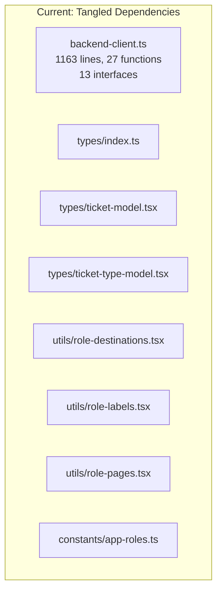
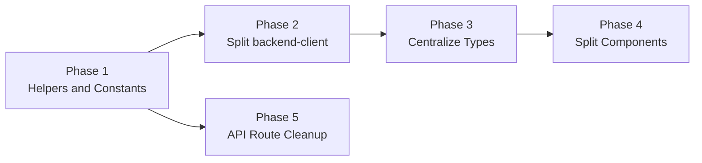

# Code Readability Improvement Plan

## Current State

The codebase has grown organically and suffers from several structural issues:

- **1 monolithic API file** (`backend-client.ts`, 1163 lines, 27 exports, 13 inline interfaces)
- **Duplicated utility functions** (`parseDateDMY` copy-pasted in 3 files)
- **Scattered type definitions** (13 interfaces in `backend-client.ts`, plus `types/index.ts`, `types/ticket-model.tsx`, `types/ticket-type-model.tsx`)
- **Fragmented role constants** across 4 tiny files
- **Inconsistent API route patterns** (different auth checks, error formats, response shapes across 12 routes)
- **Oversized components** (`EventDetailsView` 316 lines, `EventForm` 459 lines, `EventAnalytics` 325 lines)




## Phase 1: Shared helpers and consolidated constants

**Goal:** Eliminate the most duplicated code with minimal risk.

### 1a. Extract `parseDateDMY` to shared utility

The same function is copy-pasted in 3 files:

- [src/app/browse-events/BrowseEventsClient.tsx](src/app/browse-events/BrowseEventsClient.tsx) (lines 12-21)
- [src/app/organizer/OrganizerDashboardClient.tsx](src/app/organizer/OrganizerDashboardClient.tsx) (lines 14-23)
- [src/components/attendee/MyTicketsList.tsx](src/components/attendee/MyTicketsList.tsx) (lines 13-22)

**Action:** Add `parseDateDMY` to [src/lib/utils.ts](src/lib/utils.ts) and replace all 3 copies with imports.

### 1b. Consolidate role constants

4 files with overlapping role data:

- [src/utils/role-destinations.tsx](src/utils/role-destinations.tsx) (9 lines)
- [src/utils/role-labels.tsx](src/utils/role-labels.tsx) (8 lines)
- [src/utils/role-pages.tsx](src/utils/role-pages.tsx) (19 lines)
- [src/constants/app-roles.ts](src/constants/app-roles.ts) (4 lines)

Also, `sign-in` and `sign-up` pages define their own inline `ROLE_DESTINATIONS` instead of importing the shared one.

**Action:** Create [src/constants/roles.ts](src/constants/roles.ts) with a single `ROLE_CONFIG` map, exporting derived `ROLE_DESTINATIONS`, `ROLE_LABELS`, `ROLE_PAGES`, and `ONBOARDING_ALLOWED_ROLES`. Delete the 4 old files. Update all imports (including the inline copies in auth pages). Rename `.tsx` to `.ts` since no JSX.

### 1c. Create API route auth helpers

Cookie-based auth checks are duplicated in 8+ route files with inconsistent error messages (`"Unauthorized"` vs `"Authentication required"` vs `"Authentication required. Please sign in..."`).

**Action:** Create [src/lib/api-route-auth.ts](src/lib/api-route-auth.ts) with:

- `getAuthFromCookies()` -- returns `{ userId, authToken, userRole }` or null
- `requireRouteAuth(requiredRole?)` -- returns auth info or a `NextResponse` 401/403

Update all route handlers to use these helpers.

---

## Phase 2: Split `backend-client.ts`

**Goal:** Break the 1163-line monolith into domain-specific modules.

### 2a. Extract shared HTTP helper

Every function in `backend-client.ts` repeats `getAuthToken()` + `getCurrentUserId()` + header assembly + error checking. Two functions duplicate a retry loop.

**Action:** Create [src/lib/api/http.ts](src/lib/api/http.ts) with:

- `createAuthHeaders(options?)` -- builds `{ Authorization, Content-Type, X-User-Id }`
- `apiFetch(path, options?)` -- wraps `fetch` with auth headers, error handling, optional retry
- `unwrapPageResponse(data)` -- extracts array from plain array or Spring `{ content: [...] }`

### 2b. Split into domain modules

**Action:** Split [src/lib/backend-client.ts](src/lib/backend-client.ts) into:


| New file                   | Functions moved                                                                                                                      | Approx lines |
| -------------------------- | ------------------------------------------------------------------------------------------------------------------------------------ | ------------ |
| `src/lib/api/http.ts`      | shared helpers                                                                                                                       | ~80          |
| `src/lib/api/users.ts`     | `createBackendUser`, `getUserById`, `getCurrentUserId`                                                                               | ~120         |
| `src/lib/api/events.ts`    | `getEvents`, `getPublishedEvents`, `getPublishedEvent`, `getEvent`, `createEvent`, `deleteEvent`, `updateEvent`, `updateEventStatus` | ~300         |
| `src/lib/api/tickets.ts`   | `getEventTicketTypes`, `createTicketType`, `updateTicketType`, `deleteTicketType`, `getUserTickets`, `getTicketById`, `buyTicket`    | ~250         |
| `src/lib/api/staff.ts`     | `getStaffAssignedEvents`, `getGlobalStaffMembers`, `getEventStaffMembers`, `assignStaffToEvent`, `removeStaffFromEvent`              | ~150         |
| `src/lib/api/analytics.ts` | `getEventSalesHistory`, `getEventOrders`, `getEventOperationsMetrics`, `getValidationLogs`                                           | ~150         |


Keep [src/lib/backend-client.ts](src/lib/backend-client.ts) as a barrel re-export so existing imports don't break:

```typescript
export * from "./api/users";
export * from "./api/events";
export * from "./api/tickets";
export * from "./api/staff";
export * from "./api/analytics";
```

Over time, update imports to point directly at domain modules.

---

## Phase 3: Centralize types

**Goal:** One place for domain types, no more interfaces scattered in `backend-client.ts`.

### 3a. Move all interfaces to types directory

13 interfaces currently live in `backend-client.ts`. Move them to domain-grouped files:

- [src/types/users.ts](src/types/users.ts) -- `CreateUserPayload`, `UserProfile`
- [src/types/events.ts](src/types/events.ts) -- `CreateEventPayload`, `UpdateEventPayload` (merge with existing `Event`, `PublishedEvent`)
- [src/types/tickets.ts](src/types/tickets.ts) -- `CreateTicketTypePayload`, `UpdateTicketTypePayload`, `Ticket` (absorb `ticket-model.tsx`)
- [src/types/staff.ts](src/types/staff.ts) -- `StaffMember`, `StaffAssignedEvent` (remove unused `StaffAssignedEventsResponse`)
- [src/types/analytics.ts](src/types/analytics.ts) -- `SalesHistoryItem`, `RecentOrder`, `OperationsMetrics`, `TicketValidationLog`

Delete [src/types/ticket-model.tsx](src/types/ticket-model.tsx) and [src/types/ticket-type-model.tsx](src/types/ticket-type-model.tsx) (unused `TicketType` with snake_case fields). Keep [src/types/index.ts](src/types/index.ts) as a barrel re-export.

### 3b. Centralize ticket-type normalization

Snake_case-to-camelCase mapping is done inline in [src/components/events/EventDetailsView.tsx](src/components/events/EventDetailsView.tsx) (lines 67-80) and separately in `backend-client.ts`.

**Action:** Create `normalizeTicketType(raw): EventTicketType` in [src/lib/api/tickets.ts](src/lib/api/tickets.ts) and use it in both places.

---

## Phase 4: Split oversized components

**Goal:** Each component file under ~200 lines, single responsibility.

### 4a. `EventDetailsView.tsx` (316 lines)

Extract tab content into separate components:

- `components/events/tabs/OverviewTab.tsx`
- `components/events/tabs/StaffTab.tsx`
- `components/events/tabs/TicketsTab.tsx`
- `components/events/tabs/AnalyticsTab.tsx`

`EventDetailsView` becomes a shell: hero + tab bar + renders the active tab component.

### 4b. `EventForm.tsx` (459 lines)

- Extract `DateTimePicker` (lines 31-120) to `components/ui/date-time-picker.tsx`
- Extract location preview section to `components/events/LocationPreview.tsx`

### 4c. `EventAnalytics.tsx` (325 lines)

- Extract `PulseCard` and `TicketRevenueRow` sub-components (lines 281-324) to their own files in `components/organizer/`

---

## Phase 5: Standardize API route error handling

**Goal:** Consistent error responses and less boilerplate across all 12 route files.

**Action:** Create [src/lib/api-response.ts](src/lib/api-response.ts) with:

- `successResponse(data, status?)` -- returns `NextResponse.json(data, { status })`
- `errorResponse(message, status)` -- returns `NextResponse.json({ error: message }, { status })`
- `handleRouteError(error)` -- logs + returns 500 with consistent shape

Standardize all routes to use `{ error: "..." }` (not mixed `message`/`error`).

---

## Execution Order




Phases 1-3 are the highest-impact changes. Phases 4-5 are independent and can be done in any order after Phase 1.